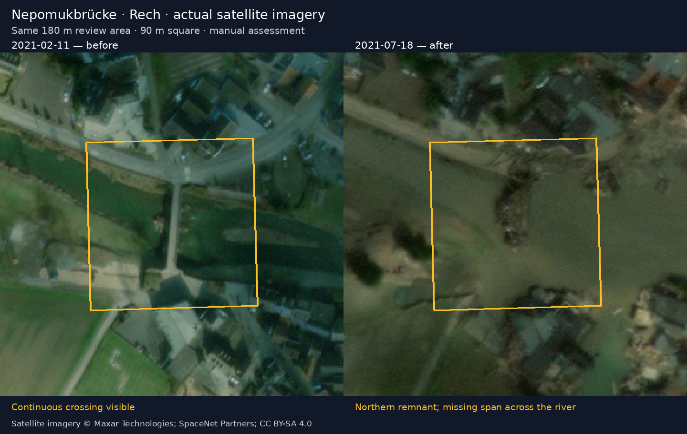

# Rech: a verified satellite bridge comparison

Downloaded and visually reviewed on 2026-10-04 (America/Vancouver).

The actual source pixels show a continuous bridge crossing on **2021-02-11**.
On **2021-07-18**, a northern section remains while a span across the widened
river is visibly missing. This is a manual image assessment; the separately
recorded CEMS `Destroyed` grade is an agency assessment. Neither establishes an
exact failure time or the condition of alternative crossings.



The outline is a **90 m square review area**, measured in EPSG:25832 around
`[7.03622715, 50.51410390]`. It highlights the crossing, rather than measuring
the damaged structure. Both panels show the same 180 m vicinity. Original RGB
GeoTIFFs were inspected before generating the aligned display images.

## Source and dates

The public SpaceNet 8 Germany release contains tile `0_40_62` covering Rech.
The original six-tile model experiment omitted this location because of its
random selection; the broader release does contain it.

| Observation | Scene | Downloaded TIFF SHA-256 |
| --- | --- | --- |
| 2021-02-11 | `10500500C4DD7000` | `dd73faaff21ad55b76a65a3b6f8a25fa747c2e50e63dadc8dcee7cb258d0d29c` |
| 2021-07-18 | `10500500E6DD3C00` | `3f5468a4e9c1d35b46dfb87cffe049e4305719a0f6299573fc3f060a1e2a2e0b` |

The scene IDs occur in the original provider's
[February 11 archive folder](https://dg-opendata.s3.amazonaws.com/?list-type=2&delimiter=/&prefix=events/western-europe-flooding21/pre-event/2021-02-11/)
and [July 18 archive folder](https://dg-opendata.s3.amazonaws.com/?list-type=2&delimiter=/&prefix=events/western-europe-flooding21/post-event/2021-07-18/).
The TIFF headers do not supply acquisition timestamps; the manifest records
day-level dates and keeps exact timestamps unknown. Sensor-native resolution
has not been established; source grids and output transforms are retained.

## Frontend handoff

Start the usual API; no processing or database query is needed to serve these
checked-in files:

```sh
uv sync --locked
uv run --locked --env-file .env uvicorn floodbeacon.api:app --reload --port 8000
```

- Manifest: `/static/imagery/rech-satellite/manifest.json`
- Before: `/static/imagery/rech-satellite/before.png`
- After: `/static/imagery/rech-satellite/after.png`
- Comparison: `/static/imagery/rech-satellite/comparison.png`
- Dated review boxes: `/static/imagery/rech-satellite/bridges.geojson`

The two map images share one **542 × 852** EPSG:3857 grid. Their combined
unannotated PNG size is about **1.31 MiB**; all three PNGs total **1.67 MiB**.
The manifest's `image_coordinates` field follows MapLibre's image-source order:
top-left, top-right, bottom-right, bottom-left, each as longitude/latitude. A
frontend can display either PNG as a georeferenced image on a pannable map.
Dates and bridge observations come from the files; no routing or country-wide
map coverage is implied. The Routes tab has not been modified.

Published imagery and derived annotations are CC BY-SA 4.0 with Maxar/SpaceNet
attribution. See the [asset license and processing notice](../src/floodbeacon/static/imagery/rech-satellite/README.md).

To reproduce the assets, run
`uv run --locked --group processing python scripts/prepare_rech_satellite.py`.
The runner verifies pinned source checksums and retrieves date-folder evidence,
aligns RGB/masks, and writes the PNGs and manifests. Raw TIFFs stay ignored.
