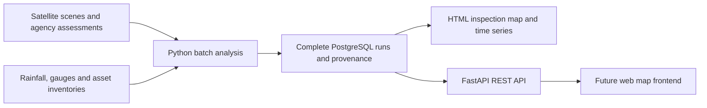

# FloodBeacon research and implementation status

Research date: 2026-10-03. Initial research performed with a Luna subagent;
the main agent checked official documentation and several live data endpoints.
The approved initial approach is now implemented as a historical research POC:
supervised SAR water classification and asset exposure, imported agency damage,
hypothetical scenarios, PostgreSQL batch storage, HTML inspection and FastAPI.
Small-sample ML training and both real batch publications are verified; a live
API and generated HTML preview expose the runs. Final checks passed 41 tests
with PostgreSQL running, compilation, live API responses and browser inspection
of both case maps and the BC observation plots. No structural-damage model or failure-time forecast is
integrated, and local flood agreement is poor for the measured Ahr comparison.

## Agreed direction

The user wants a Python/uv data repository supporting a future map frontend
through FastAPI. It must demonstrate both infrastructure impacts and future
access concerns. The user approved **two historical case studies**: a case with
the best available data, and British Columbia's November 2021 floods.

Approved initial cases:

| Case | Why use it | Initial scope and remaining gap |
| --- | --- | --- |
| Ahr Valley, Germany, July 2021 | Public satellite-derived damage grades include transportation features; good evidence for the damaged-infrastructure map. | CEMS EMSR517 AOI15, Bad Neuenahr-Ahrweiler; study bbox `[6.88, 50.37, 7.17, 50.59]`. Damage grades are agency assessments, not our detector's predictions. |
| British Columbia, November 2021 | Relevant local disaster with official road recovery evidence and historical hydrometric data. | Merritt/Coldwater and Nicola Valley/Highway 8 corridor; study bbox `[-121.48, 50.05, -120.7, 50.25]`. Highway 8 is in the Nicola watershed; the Coldwater gauge does not measure every asset. Current inventory provides context; historical impact PDF labels are not ingested. |

“Ideal data” means better evidence and annotations, not perfect sensing or
complete coverage. These two cases cannot establish general performance across
regions or reliable bridge failure prediction.

The user approved **ML flood/asset exposure**, **explicitly hypothetical
scenarios**, and **PostgreSQL storage with batch processing**. Automated building
damage is a separate pending product decision; the available pretrained models
are researched in [pretrained-models.md](pretrained-models.md), with structural
inventory/data gaps in [structural-data.md](structural-data.md).

## Data sources and access

| Source | What we can use | Access and limitations |
| --- | --- | --- |
| [CEMS EMSR517](https://mapping.emergency.copernicus.eu/activations/EMSR517/) | Flood extent/trace, roads and other transport features with agency damage grades. | Public vector ZIPs and maps. AOI15 assessment uses 0.5 m Pléiades imagery and visual interpretation. Derived products are available; original third-party imagery has separate rights. Preserve attribution and product version. |
| [Sentinel-1 RTC via Planetary Computer](https://planetarycomputer.microsoft.com/dataset/sentinel-1-rtc) | Selected source for independently modeled water change in both cases. | Public STAC; anonymous signed asset/header reads succeeded for selected scenes. Terrain-corrected gamma naught in linear units is converted to dB and averaged onto a 20 m metric grid. Terrain shadow/layover and urban/vegetated flooding remain limitations. |
| [Sentinel optical imagery via Earth Search](https://github.com/Element84/earth-search) | Candidate optical visual comparison; not part of the current classifier pipeline. | Public Sentinel-2 COG assets were tested anonymously. Cloud percentages refer to entire tiles, not the study area. Record processing baseline and apply asset scale/offset. Earth Search Sentinel-1 GRD is not equivalent to the RTC source used here. |
| [Sen1Floods11 authors' dataset](https://github.com/cloudtostreet/Sen1Floods11) | Real hand labels for the supervised CPU water baseline. | Twelve bounded sample chips fetched anonymously from the v1.1 bucket, using official train and Bolivia holdout CSVs. Labels are water/non-water/unknown; no destruction labels. Official label collection declares `proprietary`, and the authors' missing-license issue is unresolved. See [model details and exact references](model.md). |
| [DWD hourly precipitation archive](https://opendata.dwd.de/climate_environment/CDC/observations_germany/climate/hourly/precipitation/historical/) | Rainfall history for the German case. | Station metadata and ZIP time series are publicly listed. Select stations by catchment and record coverage, preserve quality flags and missing-value conventions. Station rainfall is not bridge-level flood depth. |
| [ECCC GeoMet collections](https://api.weather.gc.ca/collections?f=html) | BC daily river level/flow, climate station rainfall, available wind observations. | Public OGC API with historical collections. Query station identifiers/date range and follow pagination. Daily and hourly archives differ in station coverage. Units, local observation dates and quality flags need explicit handling. |
| [ECCC HYDAT](https://www.canada.ca/en/environment-climate-change/services/water-overview/quantity/monitoring/survey/data-products-services/national-archive-hydat.html) | Historical Canadian hydrometric records and station metadata. | Downloadable archive or GeoMet historical API. Daily means are not instantaneous flood peaks. HYDAT's SQLite distribution is an input format; it does not mean this application will use a SQLite database. |
| [BC Highway 8 recovery](https://www2.gov.bc.ca/gov/content/transportation-projects/bc-highway-flood-recovery/2021-flood-road-recovery-projects-highway-8) and [Cascades road information](https://www2.gov.bc.ca/gov/content/industry/natural-resource-use/resource-roads/local-road-safety-information/cascades-road-safety-information) | Official evidence for damaged routes/structures, recovery maps and inventories. | Likely requires source-linked manual extraction for some historical damage locations. Record location uncertainty and the difference between event date and later report date. A current bridge inventory or current closure feed is not the 2021 network. |
| [NRCan historic flood archive](https://open.canada.ca/data/en/dataset/74144824-206e-4cea-9fb9-72925a128189) | Candidate BC flood polygons and associated metadata. | Archive is selective. Verify that the chosen AOI/date exists; do not assume every affected corridor is mapped. |
| [OpenStreetMap](https://www.openstreetmap.org/copyright) | Road, bridge and settlement geometry where official inventories are insufficient. | ODbL attribution and applicable derivative-database terms. Current geometry can differ from the historical network; snapshot date and incomplete mapping must be visible. Road vectors avoid needing object detection just to locate known roads. |
| [Copernicus DEM via Earth Search](https://github.com/Element84/earth-search) | Terrain context and candidate elevation-derived flood susceptibility features. | GLO-30 is available in the catalog. Terrain resolution does not resolve bridge deck height, foundation condition, or local flow velocity. DEM alone is not a hydraulic inundation model. |
| [GloFAS through EWDS](https://confluence.ecmwf.int/spaces/CEMS/pages/242067419/EWDS) | Catchment-scale discharge histories or forecasts for later access-risk work. | Verify event coverage, issue times, model version, credentials/terms and download availability. [Reforecast access has a freeze/support-ticket notice](https://ewds.climate.copernicus.eu/datasets/cems-glofas-reforecast?tab=download). Reanalysis, reforecasts and forecasts issued at the time are different products. |
| [NASA IMERG](https://gpm.nasa.gov/data/imerg) | Global precipitation fallback where gauges are sparse. | Coarse rainfall fields, not asset-scale loads. Download paths may require Earthdata/PPS registration. Final products are retrospective and must not be substituted for the weather known at an earlier forecast cutoff. |

Check the license attached to each downloaded product and store its required
credit. [CEMS citation guidelines](https://mapping.emergency.copernicus.eu/about/citation-guidelines/)
and [terms](https://mapping.emergency.copernicus.eu/terms-and-conditions/)
distinguish service outputs from third-party material.

### Accounts that may be needed

No account was needed for the verified CEMS ZIP, ECCC queries, BC inventory,
Sen1Floods11 samples, selected Planetary Computer RTC signed/header reads, or
Earth Search optical asset/header reads. Historic RTC documentation mentioned
an account requirement, but current anonymous tests succeeded for these samples.
Access behavior and quotas may change; account-free access does not establish
redistribution rights. Additional sources have different requirements:

| Service | Account/access requirement | When to request it |
| --- | --- | --- |
| [NASA Earthdata / ASF](https://asf.alaska.edu/services/) | Free Earthdata Login for ASF downloads and [HyP3 processing](https://hyp3-docs.asf.alaska.edu/using/authentication/); service quotas may apply. | If using Sentinel-1 processing through ASF or NASA rainfall products. |
| [Copernicus Data Space](https://documentation.dataspace.copernicus.eu/APIs/OData.html) | Account and authorization token for OData product downloads. | If public linked imagery assets are unsuitable and we need this download route. |
| [CEMS EWDS](https://ewds.climate.copernicus.eu/how-to-api) | Account, API credentials and applicable dataset terms. Some reforecast access also requires a support ticket. | If the forecasting/archive route is selected. Credentials do not guarantee that the required historical forecast exists. |
| [xView2](https://xview2.org/dataset) | Dataset registration/access terms. | Only if building-damage ML becomes part of scope. |
| Pléiades or other commercial very-high-resolution imagery | Separate imagery license or approved open release. | If we pursue independent bridge-damage inference; a free catalog account does not grant commercial imagery rights. |

The user offered to provide account access when needed. Identify the exact
service and reason first; keep tokens in ignored local environment/configuration
and never print or commit credentials. No account creation or paid purchase has
been requested.

### Concrete access checks performed

- Earth Search optical candidate pairs were found: Ahr
  `S2B_32ULB_20210703_0_L2A` / `S2A_32ULB_20210718_0_L2A` (tile cloud
  11.78% / 4.34%); southern AOI also needs tile 32ULA, whose July 3 tile is
  61.23% cloudy. BC `S2A_10UFA_20211101_0_L2A` /
  `S2B_10UFA_20211116_0_L2A` (5.96% / 37.38%). Anonymous green-band range
  reads returned HTTP 206 and TIFF headers. These optical candidates have not
  been processed into POC layers.
- Planetary Computer SAR pairs use the same platform/orbit within each case:
  Ahr S1A July 3 / July 15, descending relative orbit 37; BC S1B November 4 /
  November 16, descending relative orbit 13. Exact IDs are in
  `src/floodbeacon/satellite.py`. Anonymous SAS signing and 16-byte reads
  succeeded for the event scenes. Header access proves file accessibility,
  not study-area pixel quality or detector accuracy.
- Reproduce catalog discovery with GET `/v1/search` at
  `https://earth-search.aws.element84.com` (collection `sentinel-2-l2a`), or
  GET `/api/stac/v1/search` at `https://planetarycomputer.microsoft.com`
  (collection `sentinel-1-rtc`). Use the case bbox, `limit=100`, and UTC
  `datetime=2021-07-01T00:00:00Z/2021-07-24T23:59:59Z` for Ahr or
  `datetime=2021-10-15T00:00:00Z/2021-11-17T23:59:59Z` for BC.
- The [documented CEMS product API](https://mapping.emergency.copernicus.eu/about/how-to-harvest-cems-mapping-data/emergency-response-data/)
  returned HTTP 403 from this environment. The activation page supplies static
  product links that work without that API.
- The [AOI15 initial vector ZIP](https://cems-mapping-website.s3.eu-west-1.amazonaws.com/static/activations/EMSR517/EMSR517_AOI15_GRA_PRODUCT_r1_RTP01_v1_vector.zip)
  downloaded successfully for inspection (2,865,019 bytes). It contains
  `transportationL`, `observedEventA`, hydrography, and other shapefiles. The
  transport DBF has 4,323 records and fields including `obj_type`, `damage_gra`,
  `det_method`, `or_src_id`, and `dmg_src_id`. Individual geometries and damage
  labels were subsequently ingested as 4,323 transportation features, including
  762 positive damage grades and 53 `Destroyed` grades, plus 77 agency flood
  reference features. These are transportation features, not 53 destroyed
  bridges; retain `obj_type` and original grades when interpreting them.
- The [associated official map](https://cems-mapping-website.s3.eu-west-1.amazonaws.com/static/activations/EMSR517/EMSR517_AOI15_GRA_PRODUCT_r1_RTP01_v1.pdf)
  records the situation as of 2021-07-18 and map production on July 19. Its
  0.5 m Pléiades interpretation has different timing and detail from the
  July 15 SAR output; it is not same-time ground truth for classifier accuracy.
- This query returned seven daily observations, including flow and level:
  `https://api.weather.gc.ca/collections/hydrometric-daily-mean/items?f=json&STATION_NUMBER=08LG010&datetime=2021-11-13/2021-11-19&limit=10`.
  Station: Coldwater River at Merritt. November 15 has daily mean discharge
  239 m³/s marked **Estimated**. This is not a peak flow measurement or a
  prediction, and station level is relative to its gauge datum, not asset depth.
- BC's current public bridge/culvert query returned ten structures in the
  study area. This is a present-day snapshot and may reflect repairs/removals
  since 2021. Daily precipitation/flow records are context; missing station
  observations and flags remain visible. The impact PDF is a research source,
  not an ingested set of damage classifications.
- Real training downloaded about 20.35 MB of selected inputs: nine hand-labeled
  chips from Ghana/India/Spain and three Bolivia event-holdout chips. Training
  used 111,268 sampled pixels. Holdout water IoU was 0.8418 on 669,588 valid
  pixels, with per-chip F1 0.9379, 0.8862 and 0.1034. The last-chip failure
  prevents treating a strong pooled metric as universal performance. Six ML
  inference/grid tests passed. See [model provenance](model.md).

### Actual historical output and interpretation

Both real batches published PostgreSQL runs. Initial Ahr output produced
125 candidate exposed transportation features, with 347/677 additional
hypothetical scenario features at 50/100 m. BC produced zero candidate exposures
among ten current inventory structures, with one/two additional scenario
features. These counts refer to the selected inventories and experimental
mask/parameters; they do not establish observed closures or absence of damage.

For Ahr, the modeled new-water union was 0.8028 km², the agency reference union
4.806 km² and their intersection 0.3601 km², with overlap IoU 0.0686004.
**Agreement is poor.** The agency union includes flood trace and flooded-area
evidence from July 18, while the SAR event scene is July 15. Different dates,
surface-water versus flood-trace semantics, resolution, terrain effects and
training-source domain shift prevent calling this overlap detector accuracy.
The current terrain shadow/layover screening is incomplete. A high training
holdout score does not overcome these local limitations. BC has no ingested
compatible local reference for evaluation. The preview marks modeled layers
experimental and exposes run limitations alongside the map.

## What the models can establish

### Existing damage evidence and flood detection

The implemented first pipeline combines agency damage evidence with our own
supervised flood-exposure analysis. It uses mapped assets. A Random Forest
trained on real Sen1Floods11 hand labels classifies VV/VH dB and their difference;
the pre/event score masks identify newly water-like areas only where both
observations are valid. Spatial overlay estimates candidate asset exposure in
local UTM coordinates, separately from agency grades. The 0.5 score threshold
is an initial research parameter, not an operational alert threshold.

For optical scenes, a water-index baseline needs clouds/shadows masked and an
explicit valid-observation area. For Sentinel-1, use calibrated, geometrically
aligned scenes with compatible orbit/polarization; mask terrain effects and
evaluate thresholds. Dark pixels alone are not a validated flood detector.
Urban/vegetated flooding can be missed, and acquisition timing may miss peak
flooding. The current pipeline converts RTC linear values to dB but this does
not remove the sigma-naught/gamma-naught domain difference from training.
Usable raster coverage does not certify absence of SAR shadow/layover. Local
accuracy validation and reliability masking remain work before operational use.

A bridge over permanent water will otherwise look exposed even when intact.
Approach flooding, evidence of deck damage and source-reported closure are
different signals. Avoid promoting exposure to “destroyed” or claiming a route
is open because no damage was detected.

The current ML and possible structural-damage extensions have different tasks:

- [Sen1Floods11](https://github.com/cloudtostreet/Sen1Floods11) supports SAR water
  segmentation, not bridge destruction detection. This is the current training
  source; scores are uncalibrated and labels include permanent water.
- [SpaceNet 8 research](https://openaccess.thecvf.com/content/CVPR2022W/EarthVision/papers/Hansch_SpaceNet_8_-_The_Detection_of_Flooded_Roads_and_Buildings_CVPRW_2022_paper.pdf)
  supports flooded roads/buildings using pre/post optical imagery. Flood labels
  do not mean structural destruction. Validate imagery/license and compute needs
  before selecting a model or claiming transfer to BC.
- [xBD/xView2](https://xview2.org/dataset) is primarily a building-damage benchmark;
  it does not directly validate destroyed bridges.
- Pretrained ChangeOS and ETH xBD-S12 building-damage checkpoints have verified
  account-free header access, but neither is integrated. xBD-S12 supports
  Sentinel-resolution building damage; its paired inputs and preprocessing are
  different from the water classifier. See [the model research](pretrained-models.md)
  before making a building-damage scope decision.
- Actual bridge-collapse change detection needs suitable high-resolution
  pre/post imagery, georegistration and relevant bridge labels. Existing public
  flood segmentation benchmarks do not provide that complete solution.

### Future access risk and response priority

The user approved explainable **access-risk scenarios** initially. The
implemented sensitivity layers expand the modeled new-water footprint by
50 m and 100 m horizontally and identify additional fully observed assets
intersecting those buffers. Their horizon and likelihood are null: they are
neither +24/+48-hour predictions nor water-depth/velocity simulations.
Gauge/rainfall records are historical context rather than inputs to a trained
hydraulic/failure model. Actual future-risk prediction remains a later milestone.

A measured river discharge is not water-current velocity at a bridge. Predicting
structural collapse also needs design/condition, foundations, scour, channel and
hydraulic information. [FHWA bridge scour guidance](https://www.fhwa.dot.gov/engineering/hydraulics/scourtech/scour.cfm)
illustrates why weather alone cannot establish failure time. Do not output
“will collapse in two days” from an uncalibrated score.

For a real forecast milestone, obtain weather/discharge forecasts with issue
times or train an access-disruption model with timestamped labels and asset
features. Use time/event-separated evaluation, compare with persistence, report
precision/recall and calibration only where labels support them. Two selected
events are insufficient to claim broadly reliable ML performance. Reanalysis
can support retrospective exploration, but not proof of what was predictable
before the disaster. Revised observations also need availability treatment.

Ranking communities by possible isolation is an additional graph-analysis
step: join a road network and settlements, remove or flag affected edges, and
measure changes in connectivity to agreed response origins. This requires
origins, transport mode, and acceptable treatment of uncertain edges. Until
agreed, show access concerns without inventing a rescue priority score or
boat-navigation recommendation.

## Implemented architecture and visualization

**Approved storage:** PostgreSQL 18.6 stores cases, immutable completed runs,
GeoJSON layers and observations. Each case's layers and observations publish
together in one transaction. Raw inputs, cached raster arrays, locally trained
model and provenance files remain in ignored `data/`. PostgreSQL stores JSONB;
PostGIS is not currently required. Compose includes a persistent volume,
health check and loopback-only port 55432 using the PostgreSQL 18 volume layout.

`floodbeacon train` prepares the supervised model, `floodbeacon batch` processes
one/both cases, and `floodbeacon preview` exports an HTML case selector from
completed database runs. The preview uses the same layers as FastAPI, with
separate damage/exposure/scenario/coverage layers, observation details and
source provenance. BC daily discharge and rainfall are plotted per station
with data gaps preserved; quality flags are also inspectable as data.
Basemap and CDN assets require internet. This preview is a research inspection
tool, not operational routing.

Implemented read-only API resources:

- `/health`: database connectivity; `/cases`: available published cases.
- `/cases/{case_id}/runs` and `/cases/{case_id}/runs/{run_id}`: completed runs
  and metadata with provenance, coverage and limitations.
- `/cases/{case_id}/layers/{layer}`: WGS84 GeoJSON with `run_id`, `limit`,
  `offset` and optional `bbox`. Bbox filtering is envelope overlap, not exact
  spatial intersection or clipping.
- `/cases/{case_id}/observations`: historical gauge/rainfall records and flags.

Data GET requests never fetch imagery, train models or process geospatial
inputs. Clients can pin `run_id` for consistent multi-layer rendering. API
schema/setup commands and launch examples are documented in [README.md](../README.md).

Use WGS84 longitude/latitude for GeoJSON; metric operations use a suitable local
projected CRS. Separate `observed_at`, `available_at`, `generated_at`, forecast
`issued_at`/`valid_at`, and `run_id`. Unknown dates remain unknown. Historical
mode currently shows a **retrospective summary**. Publication/availability
fields must retain source semantics; contemporary catalog ingestion timestamps
are not proof of historical availability. An as-known-at-time predictive replay
would need stronger archive evidence and leakage checks before implementation.

## Runtime and version checks

Official sources checked on 2026-10-03:

| Component | Current stable result | Implementation note |
| --- | --- | --- |
| [Python](https://www.python.org/downloads/) | 3.14.8; 3.15 is still listed as prerelease | Installed through uv; pinned in `.python-version`. Geospatial/scikit-learn dependencies installed successfully and real CPU training passed. |
| [FastAPI](https://fastapi.tiangolo.com/release-notes/) | 0.142.2, also confirmed by PyPI | Installed and locked with dependencies in `uv.lock`; implemented API reads completed database runs. |
| [PostgreSQL](https://www.postgresql.org/docs/release/) | 18.6 in the requested 18 series | Compose pins `postgres:18.6` and supplies a persistent volume and health check. |
| [uv Python management](https://docs.astral.sh/uv/guides/install-python/) | Existing uv 0.11.16 used | Its bundled interpreter manifest was older; installed 3.14.8 using Astral's current official download metadata override. Exact fallback command is in README. uv itself was not changed. |

Recheck before subsequent version changes. If a required package cannot support latest
stable Python, explain the concrete compatibility constraint before downgrading.

## Delivery verification and remaining decisions

Verified so far: interpreter/dependency setup, real small-sample supervised
training and its six contract/grid tests, live source queries, ingested agency
feature counts, actual satellite processing for both cases, completed database
publications, live API responses and generated previews. Final checks after
evaluation/timestamp/preview fixes passed 41 tests with PostgreSQL running,
compilation, and browser inspection of both maps and BC observation plots. Tests using synthetic
fixtures do not measure actual detector or forecast skill; Ahr's real dated
overlap comparison has poor agreement and BC has no compatible ingested
reference. No operational route-passability validation has been performed.

The initial detection, scenario and storage choices are resolved. Remaining
business choices concern **adding automated building damage versus keeping
roads/bridges as the damage scope**, and any later operational thresholds,
real forecast horizon, rescue-priority definition or routing origins/modes.
Pretrained building-damage research is not authorization to change scope.
BC historical impact labels and local classifier validation are documented
gaps. No model currently predicts infrastructure destruction in two days.
